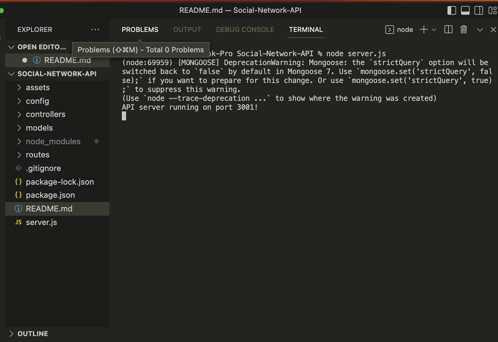
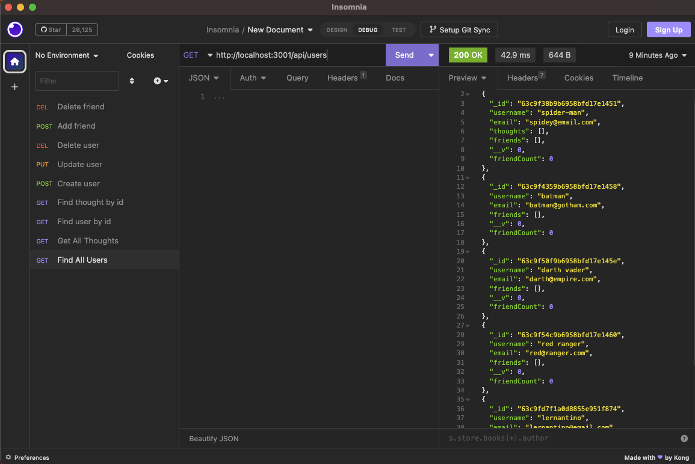

# Social-Network-API

## Description

This is an API for a social network startup that uses a NoSQL database. When the server starts, the Moongoose models are synced to the MongoDB database.
This API allows for POST, PUT, and DELETE routes in Insomnia.
The technologies used are Express.js for routing, MongoDB database, moment to capture the date, and Mongoose ODM.
The Express.js and Mongoose packages were installed for this project.
The app initiates by entering "node server.js" in the terminal.

## Visuals

## Video Link:

https://drive.google.com/file/d/1iwzss--WTg68L-gob_7qSZjFO-jmau4N/view
